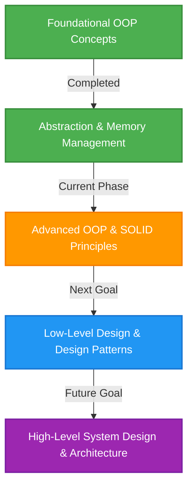

# 🚀 System Design & Object-Oriented Programming (OOP) Study Roadmap

Welcome to my **System Design and OOP** learning repository! This project serves as a structured log of my journey in mastering object-oriented paradigms, low-level design patterns, and high-level architectural systems using C++ as the primary implementation language.

---

## 🗺️ Learning Roadmap & Progress

Here is a visual roadmap of my progression from foundational programming concepts to full-scale High-Level System Design (HLD):



### Current Status: 🟩 `~40% Completed (Foundational Phase)`
- [x] **OOP Basics**: Classes, Objects, Getters/Setters, Access Specifiers.
- [x] **Memory Layout**: Memory alignment, padding, and `sizeof` analysis.
- [x] **Lifecycles**: Default, Parameterized, Overloaded, Inline, and Copy Constructors; Destructors.
- [x] **Memory Management**: Stack vs Heap Allocation, dynamic memory with `new` and `delete`.
- [x] **Abstraction & Interfaces**: Abstract classes and pure virtual functions.
- [ ] **Inheritance & Polymorphism** *(Next Goal)*
- [ ] **SOLID Principles** *(Next Goal)*
- [ ] **Low-Level Design (LLD)** *(Future Goal)*
- [ ] **High-Level Design (HLD)** *(Future Goal)*

---

## 📂 Repository File Structure

Here is the current directory structure of the repository:

```text
SystemDesign/
├── README.md                      # Study documentation and roadmap
├── abstraction.cpp                # Core abstraction and interface implementation
├── oops/                          # Folder containing basic OOP building blocks
│   ├── class.cpp                  # Class definition, encapsulation, getters/setters
│   ├── obj.cpp                    # Object sizes, memory alignment, and padding
│   ├── constructor.cpp            # All constructor types (Default, Param, Copy, Inline)
│   ├── destructor.cpp             # Destructors, deletion order, and heap cleanup
│   └── dynamicMemoryAllocation.cpp # Dynamic allocation using the 'new' and 'delete' operators
```

---

## 📝 Concepts Explored & Implemented

### 1. Foundational OOP & Encapsulation
*   **[oops/class.cpp](file:///e:/SystemDesign/oops/class.cpp)**: Demonstrates the creation of a `Student` class, private member variables, and encapsulation using public getter and setter methods (`setname`, `getName`, etc.) along with boundary validation.
*   **[oops/obj.cpp](file:///e:/SystemDesign/oops/obj.cpp)**: Deep dive into **Memory Alignment & Padding**. Explores how the compiler aligns different data types (`char`, `int`, `double`) within structures and calculates class sizes using `sizeof`.

### 2. Lifecycles & Memory Management
*   **[oops/constructor.cpp](file:///e:/SystemDesign/oops/constructor.cpp)**: Covers object initialization strategies:
    *   **Default Constructor** (sets default values).
    *   **Parameterized Constructor** (with custom values and `this` pointer).
    *   **Constructor Overloading** (multiple initialization pathways).
    *   **Inline Member Initializer Lists** (performance-optimized constructor syntax).
    *   **Copy Constructor** (creates deep copies of existing objects).
*   **[oops/destructor.cpp](file:///e:/SystemDesign/oops/destructor.cpp)**: Implements destructors (`~Customer`) to handle resource cleanup and showcases the **LIFO (Last-In-First-Out) destruction order** for stack-allocated objects, as well as explicit cleanup of heap-allocated objects.
*   **[oops/dynamicMemoryAllocation.cpp](file:///e:/SystemDesign/oops/dynamicMemoryAllocation.cpp)**: Demonstrates how to allocate objects dynamically on the **Heap** using `new` and access members via pointer operators (`->` and `*`), followed by proper memory deallocation.

### 3. Core Abstraction & Interfaces
*   **[abstraction.cpp](file:///e:/SystemDesign/abstraction.cpp)**: Builds a clean model representing Abstraction. Declares a pure interface `Car` with pure virtual functions (`startEngine`, `gearShift`, `accelerate`, etc.) and implements concrete behaviors in a derived class `SportsCar`. Establishes the use of virtual destructors (`virtual ~Car()`) to prevent memory leaks in derived classes.

---

## 🎯 Next Learning Goals

### Phase 1: Advanced OOP Concepts
*   **Inheritance**: Single, Multiple, Multilevel, Hierarchical, and Hybrid inheritance.
*   **Polymorphism**: 
    *   *Compile-time*: Function Overloading & Operator Overloading.
    *   *Runtime*: Method Overriding, Virtual Functions, and understanding the internals of Virtual Tables (`vtable` and `vptr`).

### Phase 2: SOLID Design Principles
*   **S**: Single Responsibility Principle
*   **O**: Open/Closed Principle
*   **L**: Liskov Substitution Principle
*   **I**: Interface Segregation Principle
*   **D**: Dependency Inversion Principle

### Phase 3: Low-Level Design (LLD)
*   **Design Patterns**: Creational (Singleton, Factory), Structural (Adapter, Facade), and Behavioral (Observer, Strategy).
*   **Case Studies**: Designing real-world systems like a Parking Lot, Movie Ticket Booking System, or Splitwise.

### Phase 4: High-Level Design (HLD)
*   System scalability, Load Balancing, CDN, Caching strategies, Database Sharding, Replication, CAP Theorem, and Microservice Architectures.

---

## 🛠️ How to Run the Code

To compile and run any of the C++ files in this repository, ensure you have a C++ compiler installed (like `g++`).

### Compiling via CLI
Navigate to the repository folder and compile using:
```bash
# To run files in the oops directory
g++ oops/class.cpp -o oops/class.exe
./oops/class.exe

# To run the abstraction demo
g++ abstraction.cpp -o abstraction.exe
./abstraction.exe
```

---

*“Design is not just what it looks like and feels like. Design is how it works.” – Steve Jobs*
